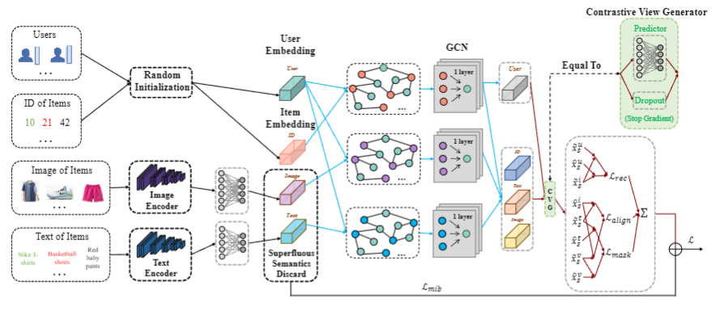

## PDM

## Overview of PDM

## environment
1. lmdb
2. torch
3. torchvision
4. pyyaml
5. scipy

## How to run
1. Put your downloaded data (e.g. `sports`) under `data` dir.
2. Enter `src` folder and run with  
`python main.py -m BM3 -d sports`  
You may specify other parameters in CMD or config with `configs/model/*.yaml` and `configs/dataset/*.yaml`.

 
